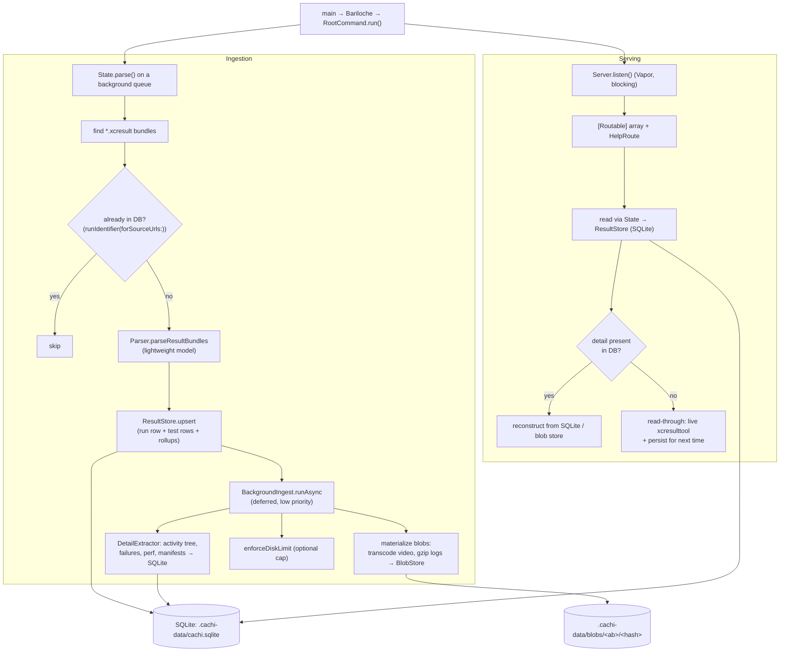
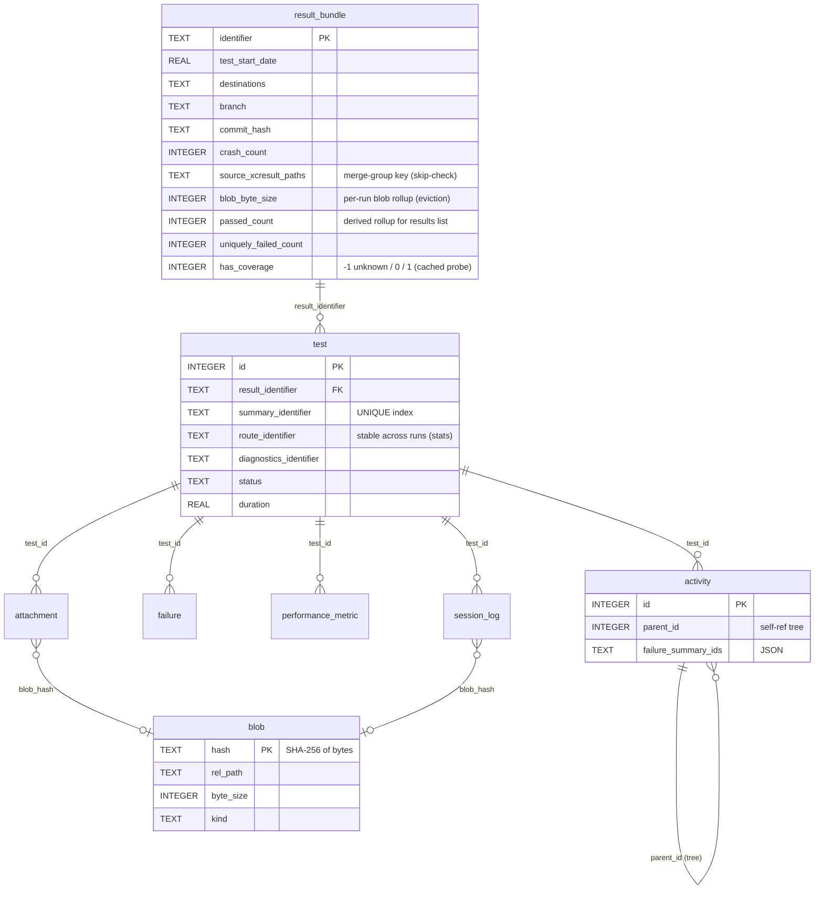

# Cachi Architecture

Cachi is a Swift command-line server that discovers Xcode `.xcresult` bundles on disk, ingests them into a **persistent SQLite database plus a content-addressed blob store**, and exposes that data both as JSON APIs and as server-rendered HTML pages.

The store lives in a `.cachi-data/` directory inside the results path you launch against, so it **survives external pruning of the dated run folders**. History (run metadata, the test list, failure detail, stats) outlives the `.xcresult` bundles that produced it.

> This document describes the SQLite-backed design. For the empirical study that justified it see [`INGEST_BENCHMARK.md`](INGEST_BENCHMARK.md); for the exhaustive map of what `xcresulttool` exposes and how it maps onto the schema see [`XCRESULTTOOL_DATA_MODEL.md`](XCRESULTTOOL_DATA_MODEL.md); for the HTTP surface see [`ENDPOINTS.md`](ENDPOINTS.md).

## High-level flow

There are two cooperating subsystems:

1. **Ingestion / State** — discovers bundles, parses the lightweight model, writes it to SQLite, and defers the heavy work (per-test failure detail + blob materialization) to a low-priority background pass.
2. **HTTP server** — a Vapor app that maps a fixed list of `Routable` objects to URL paths. Routes are thin: they read structured data from SQLite via `State`, and for per-test detail they *read through* to the database (falling back to live `xcresulttool` only on a miss).

## Entry point and configuration

- `main.swift` → `Bariloche` argument parser → `RootCommand`.
- `RootCommand.run()` (`Sources/Cachi/Commands/RootCommand.swift`):
  - Resolves the base search path, parse depth (default 2), `--merge` flag, optional `--max_disk_size` (MB), and any `--attachment_viewer` mappings.
  - Calls `Cachi.createDataStore(baseUrl:)` to create `.cachi-data/` (+ `blobs/`).
  - Kicks off `State.shared.parse(...)` on a background `userInteractive` queue.
  - Constructs `Server` and calls `listen()` (blocking).

Global constants and store locations live in `Cachi.swift`:
- `dataFolderName = ".cachi-data"` — the persistent store directory, a **sibling** of the dated run folders so it survives their pruning.
- `databaseUrl(baseUrl:)` → `.cachi-data/cachi.sqlite`.
- `blobsUrl(baseUrl:)` → `.cachi-data/blobs/`.
- `temporaryFolderUrl = /tmp/Cachi` — scratch for exported attachments, muxed video-capture files, and split coverage.
- `cacheFolderName = ".Cachi"` — per-bundle coverage scratch (legacy name, coverage only).

## The storage layer

### `Database` (`Sources/Cachi/Database/Database.swift`)

The single SQLite-backed store. Concurrency model:

- **One serial writer** (`writerQueue`). All mutations funnel through `write { }` / `transaction { }`. These are **not reentrant** — a body must operate on the passed connection, never call back into `write`/`transaction` (that would deadlock the serial queue on itself).
- **A pool of read-only connections** (`min(8, max(2, cores))`), handed out under a lock + semaphore. WAL mode lets readers run concurrently with each other and with the writer, so a slow query doesn't block unrelated reads.
- PRAGMAs: `journal_mode=WAL`, `synchronous=NORMAL`, `foreign_keys=ON`, `busy_timeout=5000`.
- `query()` degrades a failed read to an empty array (so one bad query yields an empty page rather than a 500), but logs loudly and trips a debug assertion.
- `performMaintenance()` runs `PRAGMA optimize` + `wal_checkpoint(TRUNCATE)` after each parse pass.

Schema is created by an idempotent migration runner (`schema_version` table; each step's DDL and the version bump commit atomically). The schema (v1):

Notable design choices baked into the schema:

- **`result_bundle` carries derived rollups** (`passed_count`, `uniquely_failed_count`, `failed_by_system_count`, `failed_retrying_count`, `total_count`, `first_*`) written at ingest by `upsert`. The results-list endpoints read these directly, so listing cost scales with the **number of runs**, not the total number of tests in all history.
- **`source_xcresult_paths`** (newline-joined, sorted) is the merge-group key. `runIdentifier(forSourceUrls:)` uses it to skip bundles already ingested.
- **`blob_byte_size`** is a per-run rollup maintained incrementally as blobs materialize, so disk-limit eviction can attribute usage to runs without scanning the filesystem.
- **`has_coverage`** caches a `FileManager.fileExists` probe (-1 unknown → resolved once, then 0/1) so the results list never touches the filesystem on the hot path.
- **`summary_identifier`** has a **unique** index (one detail summary per test execution); `route_identifier` and `(target,device_model,device_os)` are indexed for the stats queries.

### `ResultStore` (`Sources/Cachi/Database/ResultStore.swift`)

The typed mapping between `ResultBundle`/`ResultBundle.Test` and the SQL rows. Responsibilities:

- `upsert(_:)` — replace a run's rows in one transaction (DELETE cascades children, then re-INSERT), writing the run row, its test rows, and the derived rollups.
- Indexed reads: `resultBundle(identifier:)`, `test(summaryIdentifier:)`, `testWithResultBundle(...)`, `tests(routeIdentifier:limit:)`, `resultBundles(containingRouteIdentifier:limit:)`, plus the stats helpers (`statsTests(...)`).
- `resultSummaries()` — the lightweight per-run rollup list (no `test` join, no `ResultBundle.make`).
- Detail-extraction tracking: `testsNeedingDetailExtraction()` (failed tests with no `activity`/`session_log` rows yet), and `writeDetail(...)` which persists the activity tree (flattened, parent-linked), failures, performance metrics, and attachment + session-log **manifests** (blob bytes excluded — `blob_hash` left NULL).
- Read-through reconstruction: `reconstructTestSummary(summaryIdentifier:)` rebuilds a CachiKit `ActionTestSummary` (activity tree + failures + attachments + perf) from the structured tables, returning `nil` (a miss) when no detail has been extracted yet.
- Blob-hash setters (`setAttachmentBlobHash`, `setSessionLogBlobHash`) that also fold the blob size into the run rollup on the NULL→set transition only (so re-sets never double-count).

### `BlobStore` (`Sources/Cachi/Database/BlobStore.swift`)

Content-addressed store for the only heavy artifacts: transcoded videos and gzipped session logs (screenshots too, if ever captured). Files live at `.cachi-data/blobs/<first-2-hex>/<full-sha256>`, keyed by the SHA-256 of their bytes, so identical content (e.g. the same failure frame across retries) is stored **once**. SQLite holds the manifest (`blob` table + the `*.blob_hash` columns); this type owns the bytes.

- `store(_:kind:)` / `store(fileAt:kind:)` — hash, dedup (skip the write if the hash already exists), insert the manifest row `ON CONFLICT DO NOTHING`.
- `collectGarbage()` — delete blob files (and rows) no longer referenced by any `attachment`/`session_log`.
- `enforceDiskLimit(maxBytes:)` — when the `blob_byte_size` rollup sum exceeds the cap, **evict whole runs oldest-first** (by `ingested_at`), cascading the delete to all their rows. **A run whose `.xcresult` is still on disk is never evicted** — its blobs are re-derivable and its row must survive so the next parse's skip-check doesn't re-ingest it. Eviction therefore only reclaims runs already pruned externally, for which the blobs are the only remaining copy.

## The ingestion pipeline

`Parser` (`Sources/Cachi/Parser.swift`) is the bridge to Xcode via `CachiKit` (every call shells out to `xcrun xcresulttool ...` and decodes with `ZippyJSON`). It produces only the **lightweight model**: the flat `[ResultBundle.Test]` with metadata, durations, statuses, and identifiers, plus derived collections via `ResultBundle.make`. Crash count is "optimistic" — derived from issue-summary messages containing `" crashed in "` rather than opening every heavy `ActionTestSummary`.

What the parser deliberately does **not** materialize at parse time: per-test activity trees, failure detail, attachments, and session logs. Those are handled by the deferred pass.

### Deferred detail + blobs (`BackgroundIngest`, `DetailExtractor`, `VideoTranscoder`)

After the structured parse, `State.parse()` calls `backgroundIngest.runAsync { ... }` on a `.utility` queue. For each failed test still needing work it:

1. **Extracts structured detail** (`DetailExtractor.extractDetail`): fetches the heavy `ActionTestSummary`, flattens the activity tree (depth-first, parent-linked), collects failures, perf metrics, and attachment/session-log manifests, and writes them via `ResultStore.writeDetail` (one transaction). `blob_hash` stays NULL.
2. **Materializes blobs**: exports each video attachment, transcodes it with `VideoTranscoder` (AVFoundation, `AVAssetExportPresetMediumQuality` — no external binary), stores it in the blob store, and sets the hash. Session-log channels are fetched, gzipped, and stored similarly.

Properties of the background pass:

- **Idempotent & resumable** — a test with detail already present is skipped; a blob whose hash is set is not re-materialized. An interrupted process simply re-detects the remaining work next launch (`testsNeedingDetailExtraction()` finds anything missing).
- **Overlap-guarded** — a `runLock`/`isRunning` flag makes a second `run()` (e.g. from a repeated `/v1/parse`) return immediately rather than redo the same work concurrently.
- **Bounded concurrency** — `maxConcurrent = cores/2` so transcoding doesn't starve request serving.
- **Off the critical path** — a failure flood grows the backlog instead of blocking parse or requests; the raw artifact stays servable from the bundle meanwhile (read-through fallback).

## State: the access layer

`State` (`Sources/Cachi/State.swift`) is the singleton (`State.shared`) every route reads through. Unlike the old design it holds **no in-memory bundle corpus** — it owns the `Database`/`ResultStore`/`BlobStore`/`BackgroundIngest`, lazily configured on first `parse` (which needs the results `baseUrl`), guarded by a concurrent `DispatchQueue`.

Key responsibilities:
- `parse(...)` — discovery + skip-check + lightweight parse + upsert + async coverage split + maintenance + deferred background ingest + optional disk-limit enforcement.
- `pendingResultBundles(...)` — fast identifiers (DB hit, or a quick partial parse) so the UI shows something before full parse.
- Indexed lookups: `result(identifier:)`, `test(summaryIdentifier:)`, `testWithResultBundle(...)`, `allTargets()`, `allDevices(in:)`, `allTests(in:)`.
- **Read-through detail**: `testActionSummary` rebuilds from SQLite, else reads live; `testSessionLogs` serves gunzipped blobs, else extracts live and persists; `materializeVideo` prefers the **original high-quality** recording exported from the `.xcresult` and falls back to the transcoded blob once the bundle is pruned.
- Statistics computed from indexed reads: `resultsTestStats` (flaky/slowest/fastest sliding window) and `testStats` (per-test history capped at ~50 matching runs).

## The HTTP server

`Server` (`Sources/Cachi/Server/Server.swift`):
- Builds a fixed `[Routable]` array, appends a `HelpRoute` that reflects over the others, and registers each with Vapor via `app.on(method, path, use: respond)`.
- HTTP/1 only, response compression enabled (`Response+Compression` disables it for already-compressed bodies like mp4).
- `NotFoundMiddleware` installed at the start of the chain.

`Routable` (`path`, `description`, `method`, `respond(to:)`) keeps routes uniform and lets `HelpRoute` auto-generate `/v1/help`.

### Route families

- **JSON API (`/v1/...`, `/v2/...`)** — machine-readable; serialize straight from SQLite reads.
- **HTML (`/html/...`, `/`)** — server-rendered with the `Vaux` DSL; build view models and pull per-test detail through the read-through path.
- **Asset / binary** — `/css`, `/script`, `/image`, `/attachment`, `/video_capture`, `/v1/xcresult`. Stream files; export/transcode into `/tmp/Cachi` on first access.
- **Control** — `/v1/parse`, `/v1/kill`, `/v1/version`, `/v1/results_identifiers`.

### Two-tier data access at request time

1. **Cheap, indexed SQLite reads**: results list, result detail, test list, stats. Served from `result_bundle`/`test` rows (and the precomputed rollups for the list).
2. **Read-through detail**: a single test's activity tree, failures, attachments, video, session logs. Served from the detail tables / blob store when materialized; otherwise fetched live from the `.xcresult` via `CachiKit` and persisted for next time.

This split is the core performance design: indexed structured reads for everything list-like and statistical, and heavy per-test detail materialized once (at background ingest) then served from the store — with the bundle on disk as a self-healing fallback.

## Concurrency model

- **Parsing** uses `OperationQueue`s for parallelism across bundles/tests.
- **Database** uses a single serial writer + a pooled set of readers under WAL; the writer is non-reentrant by contract.
- **Background ingest** runs at `.utility` QoS, concurrency capped at `cores/2`, overlap-guarded.
- **Vapor** serves requests concurrently; reads hit the reader pool, writes (read-through persistence, blob-hash sets) funnel through the serial writer.

## Data lifecycle summary

| Stage | Where it lives | Cost | Persisted across restarts / pruning? |
|-------|----------------|------|--------------------------------------|
| Bundle discovery | filesystem walk | cheap | n/a |
| Run + test metadata + rollups | SQLite `result_bundle` / `test` | parse once | **yes** — survives `.xcresult` pruning |
| Failure detail (activity tree, failures, perf, manifests) | SQLite `activity`/`failure`/`performance_metric`/`attachment`/`session_log` | deferred background extract | **yes** (failures only; passing tests keep metadata) |
| Blob bytes (transcoded video, gzipped logs) | `.cachi-data/blobs/` (content-addressed) | deferred transcode/gzip | **yes**, deduped; capped by `--max_disk_size` |
| Passing-test step trees / arbitrary attachments | inside `.xcresult` | live `xcresulttool` on demand | no (read-through while bundle exists) |
| Exported attachments / muxed video / coverage | `/tmp/Cachi`, `.Cachi/coverage` | first-access export | until `/tmp` cleared |
| Cross-run history / stats | indexed SQLite reads | O(matching rows) per query | **yes** |
