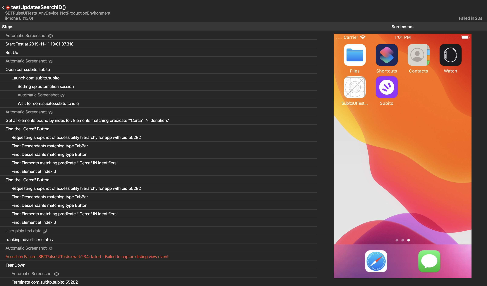

# 🌵 Cachi

Cachi is a swift tool to parse and visualize test results contained in Xcode's .xcresult files on a web interface.




# Installation

```
brew install Subito-it/made/cachi
```

Or you can build manually using swift build.


# Usage

Cachi can be launched by passing the port for the web interface and the location where it should search for the .xcresult bundles.

You can optionally pass `--search_depth` to specify how deep Cachi should traverse the location path. Default is 2, larger values may impact parsing speed. 

```bash
$ cachi --port number [--search_depth level] path
```


# Contributions

Contributions are welcome! If you have a bug to report, feel free to help out by opening a new issue or sending a pull request.


## Authors

[Tomas Camin](https://github.com/tcamin) ([@tomascamin](https://twitter.com/tomascamin))


## License

Cachi is available under the Apache License, Version 2.0. See the LICENSE file for more info.
